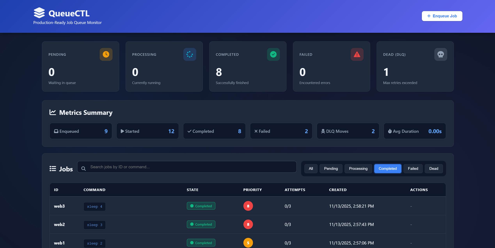
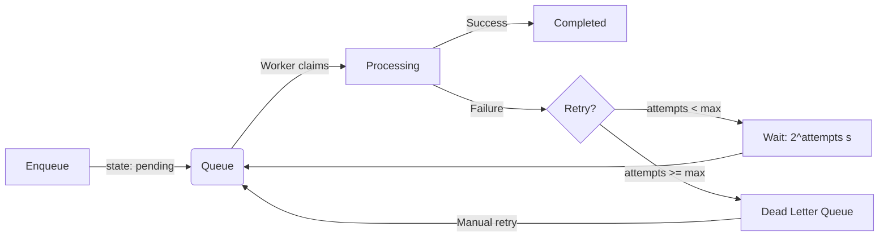

<div align="center">

# 🚀 QueueCTL

### Production-Ready Background Job Queue System

*A robust, scalable CLI-based job queue built with Python for reliable task processing*

[](https://www.python.org/downloads/)
[](tests/)
[](LICENSE)
[](https://github.com/psf/black)

[Features](#-features) • [Quick Start](#-quick-start) • [Demo Video](#-demo-video) • [Documentation](#-documentation) • [Architecture](#-architecture) • [Testing](#-testing)

</div>

---

## 🎥 Demo Video

Watch a complete walkthrough of QueueCTL's features:

📹 **[View Demo on Google Drive](https://drive.google.com/file/d/1PgSm1GozRotww1lqMrA4-81CA3x_S4j0/view?usp=sharing)**

*The video covers: installation, enqueueing jobs with priorities, multi-worker execution, retry mechanisms, Dead Letter Queue management, scheduled jobs, metrics monitoring, and web dashboard.*

### 📸 Web Dashboard Preview



---

## 📋 Overview

QueueCTL is a **production-ready background job queue system** designed to handle task processing with reliability and resilience. Built from scratch in Python, it demonstrates enterprise-level software engineering practices including atomic operations, graceful error handling, and comprehensive testing.

### Why QueueCTL?

- ⚡ **Fast Setup**: Single command installation, zero external dependencies
- 🔒 **Reliable**: Atomic job claiming prevents race conditions
- 🔄 **Resilient**: Automatic retries with exponential backoff
- 📊 **Observable**: Detailed logging and status monitoring
- 🧪 **Well-Tested**: 49 comprehensive tests covering all features
- 🎯 **Production-Ready**: Type hints, custom exceptions, graceful shutdown

---

## ✨ Features

### Core Capabilities

| Feature | Description |
|---------|-------------|
| **Background Processing** | Execute long-running tasks asynchronously without blocking |
| **Multi-Worker Support** | Parallel processing with configurable worker count |
| **Priority Queues** | Jobs with priority 1-10 (10=highest) processed first |
| **Scheduled Jobs** | Delay job execution until specific datetime |
| **Automatic Retries** | Exponential backoff retry mechanism (2^attempts seconds) |
| **Dead Letter Queue** | Failed jobs isolated for manual inspection and retry |
| **Metrics & Monitoring** | Track job events, durations, and failure patterns |
| **Web Dashboard** | Real-time monitoring UI with auto-refresh and job management |
| **Persistent Storage** | SQLite-based queue survives restarts |
| **Atomic Operations** | `BEGIN IMMEDIATE` transactions prevent duplicate processing |
| **Graceful Shutdown** | Workers finish current job before exiting (30s timeout) |
| **Complete CLI** | 15+ commands for full queue management |

### Technical Highlights

- ✅ **Type-Safe**: Complete type hints with mypy validation
- ✅ **Custom Exceptions**: Specific error types for better debugging
- ✅ **Worker Health Monitoring**: Heartbeat tracking and metrics
- ✅ **Transaction Safety**: Documented isolation levels with rollback handling
- ✅ **Concurrency Tested**: Stress tests with 10 concurrent workers
- ✅ **Priority Scheduling**: Composite indexes for optimal query performance

---

## 🚀 Quick Start

### Installation

```bash
# Clone the repository
git clone https://github.com/ArshdKhan/queuectl.git
cd queuectl

# Set up virtual environment
python -m venv venv
source venv/bin/activate  # On Windows: venv\Scripts\activate

# Install QueueCTL
pip install -e .
```

### Basic Usage

```bash
# 1. Enqueue jobs with different priorities
queuectl enqueue '{"id":"low","command":"echo low priority","priority":3}'
queuectl enqueue '{"id":"high","command":"echo high priority","priority":10}'
queuectl enqueue '{"id":"normal","command":"echo normal","priority":5}'

# 2. Schedule a job for later execution
queuectl enqueue '{"id":"scheduled","command":"python backup.py","run_at":"2024-12-31T23:59:00"}'

# 3. Start workers (opens in foreground, press Ctrl+C to stop)
queuectl worker start --count 2

# 4. Monitor queue (CLI or Web Dashboard)
# Option A: CLI commands
queuectl status
queuectl metrics
queuectl list --state completed

# Option B: Web Dashboard (open http://127.0.0.1:5000 in browser)
queuectl web
```

---

## 📚 Documentation

### CLI Commands Reference

<details>
<summary><b>Job Management Commands</b></summary>

```bash
# Basic job enqueuing
queuectl enqueue '{"id":"job1","command":"echo test"}'

# Enqueue with priority (1-10, 10=highest)
queuectl enqueue '{"id":"urgent","command":"python critical.py","priority":10}'
queuectl enqueue '{"id":"background","command":"python cleanup.py","priority":2}'

# Enqueue with custom retry limit
queuectl enqueue '{"id":"job2","command":"python script.py","max_retries":5}'

# Schedule job for specific time (ISO8601 format)
queuectl enqueue '{"id":"future","command":"python task.py","run_at":"2024-12-31T10:00:00"}'

# List all jobs
queuectl list

# Filter jobs by state
queuectl list --state pending
queuectl list --state completed
queuectl list --state failed

# View queue statistics
queuectl status
# Output:
# === Queue Status ===
# Pending:    5
# Processing: 2
# Completed:  10
# Failed:     1
# Dead (DLQ): 1
```

</details>

<details>
<summary><b>Worker Management Commands</b></summary>

```bash
# Start workers (foreground mode)
queuectl worker start --count 3

# Stop workers gracefully
queuectl worker stop

# Check worker health (shows monitoring info)
queuectl worker health
```

</details>

<details>
<summary><b>Web Dashboard</b></summary>

```bash
# Start web monitoring dashboard
queuectl web

# Custom host/port
queuectl web --host 0.0.0.0 --port 8080

# Enable debug mode
queuectl web --debug
```

**Features**:
- 📊 Real-time queue statistics
- 📋 Job list with filtering by state
- 🎯 Priority and scheduling visualization
- 📈 Metrics and event tracking
- 🔄 Auto-refresh every 5 seconds
- 🔁 One-click DLQ job retry

**Access**: Open `http://127.0.0.1:5000` in your browser

</details>

<details>
<summary><b>Dead Letter Queue (DLQ) Commands</b></summary>

```bash
# View jobs that exceeded max retries
queuectl dlq list

# Retry a failed job (resets attempt counter)
queuectl dlq retry job-id-here
```

</details>

<details>
<summary><b>Metrics & Monitoring Commands</b></summary>

```bash
# View metrics summary
queuectl metrics
# Output:
# === Job Metrics Summary ===
# Event Counts:
#   enqueued: 15
#   started: 12
#   completed: 10
#   failed: 2
#   dlq: 0
# 
# Average Duration: 1.23 seconds
# 
# Recent Events (last 10):
#   [2024-01-15 10:30:00] job3: completed (1.2s)
#   [2024-01-15 10:29:58] job3: started
#   [2024-01-15 10:29:45] job2: failed (0.5s) - Command not found

# Show more recent events
queuectl metrics --recent 50
```

</details>

<details>
<summary><b>Configuration Commands</b></summary>

```bash
# View all configuration
queuectl config get

# View specific setting
queuectl config get max-retries

# Update configuration
queuectl config set max-retries 5
queuectl config set backoff-base 3.0
queuectl config set job-timeout 600
```

</details>

---

## 🏗️ Architecture

### System Design

```
        ┌─────────────┐
        │   CLI User  │
        └──────┬──────┘
               │ queuectl enqueue
               ▼
      ┌─────────────────┐
      │  Queue Manager  │ ◄─── Configuration
      └────────┬────────┘
               │
               ▼
      ┌─────────────────┐
      │ SQLite Storage  │ (Persistent Queue + Metrics)
      └────────┬────────┘
               │
               ▼ claim_job() [ATOMIC]
  ┌────────────────────────────┐
  │      Worker Pool           │
  │  ┌──────┐┌──────┐┌──────┐  │
  │  │ W-0  ││ W-1  ││ W-2  │  │
  │  └──┬───┘└──┬───┘└──┬───┘  │
  └─────┼───────┼───────┼──────┘
        │       │       │
        ▼       ▼       ▼
     Execute  Execute  Execute
     Command  Command  Command
```

### Component Breakdown

**1. Job Model** (`models/job.py`)
- Dataclass with 5 states: `pending` → `processing` → `completed`/`failed`/`dead`
- Built-in retry logic with `should_retry()` and `calculate_backoff()`
- Priority (1-10) and scheduling (run_at) support

**2. Storage Layer** (`storage/sqlite_store.py`)
- SQLite database with ACID transactions
- Atomic job claiming using `BEGIN IMMEDIATE`
- Composite indexes: `(state, priority DESC, created_at)` and `(state, run_at)`
- Separate `job_metrics` table for event tracking

**3. Queue Manager** (`queue/manager.py`)
- Facade pattern over storage layer
- Handles state transitions and validation
- Automatic metrics recording on state changes
- Custom exceptions for specific error cases

**4. Worker Pool** (`worker/pool.py`)
- Multiprocessing-based parallelism
- Health monitoring with heartbeat tracking
- Graceful shutdown with signal handlers
- Refactored for maintainability (functions <20 lines)

**5. Job Executor** (`worker/executor.py`)
- Subprocess-based command execution
- Configurable timeout (default 300s)
- Captures stdout/stderr for debugging

---

## 🔄 Job Lifecycle



### Retry Mechanism Details

| Attempt | Delay | Example |
|---------|-------|---------|
| 1st failure | 2^0 = 1s | Job retries after 1 second |
| 2nd failure | 2^1 = 2s | Job retries after 2 seconds |
| 3rd failure | 2^2 = 4s | Job retries after 4 seconds |
| Max retries | - | Job moves to DLQ |

**Configurable**: Change `backoff_base` to 3.0 for slower backoff (3^attempts)

---

## 🎯 Advanced Features

### Priority Queues

Jobs can be assigned priority levels from 1-10 (10=highest). Higher priority jobs are processed first:

```bash
# Critical job - processed immediately
queuectl enqueue '{"id":"critical","command":"python urgent_fix.py","priority":10}'

# Normal job - default priority 5
queuectl enqueue '{"id":"normal","command":"python regular_task.py"}'

# Background job - runs when nothing else pending
queuectl enqueue '{"id":"cleanup","command":"python cleanup.py","priority":1}'
```

**How it works:**
- Worker claims jobs using `ORDER BY priority DESC, created_at ASC`
- Within same priority, FIFO order maintained
- Database uses composite index `(state, priority DESC, created_at)` for optimal performance

### Scheduled Jobs

Delay job execution until a specific datetime:

```bash
# Run at specific time (ISO8601 format)
queuectl enqueue '{"id":"backup","command":"python backup.py","run_at":"2024-12-31T23:59:00"}'

# Calculate future time in your script
python -c "from datetime import datetime, timedelta; print((datetime.utcnow() + timedelta(hours=2)).isoformat())"
# Then enqueue: queuectl enqueue '{"id":"delayed","command":"echo ready","run_at":"2024-01-15T12:30:00"}'
```

**How it works:**
- Jobs with `run_at` in future stay in pending state
- Workers only claim jobs where `run_at IS NULL OR run_at <= NOW()`
- Useful for delayed notifications, scheduled reports, rate limiting

### Metrics & Observability

Track job execution patterns and performance:

```bash
queuectl metrics
```

**Output example:**
```
=== Job Metrics Summary ===
Event Counts:
  enqueued: 150
  started: 145
  completed: 130
  failed: 15
  dlq: 5

Average Duration: 2.45 seconds

Recent Events (last 100):
  [2024-01-15 10:30:15] job142: completed (1.2s)
  [2024-01-15 10:30:13] job142: started
  [2024-01-15 10:30:10] job141: failed (0.8s) - Connection timeout
  ...
```

**Tracked events:**
- `enqueued`: Job added to queue
- `started`: Worker began processing
- `completed`: Job finished successfully
- `failed`: Job execution failed (before retry or DLQ)
- `dlq`: Job moved to Dead Letter Queue

**Use cases:**
- Identify slow jobs (high avg duration)
- Detect failure patterns
- Monitor queue throughput
- Debug timing issues

---

## 🧪 Testing

### Test Suite Overview

```bash
# Run all 49 tests
pytest tests/ -v

# Expected output:
# tests/test_queue.py ............... (13 passed)  ✓ Queue operations
# tests/test_worker.py .............. (5 passed)   ✓ Job execution
# tests/test_integration.py ......... (7 passed)   ✓ Full lifecycle
# tests/test_concurrency.py ......... (4 passed)   ✓ Race conditions
# tests/test_priority.py ............. (5 passed)   ✓ Priority queues
# tests/test_scheduling.py ........... (7 passed)   ✓ Scheduled jobs
# tests/test_metrics.py .............. (8 passed)   ✓ Metrics tracking
# ============================================
# 49 passed in 8.16s
```

### What's Tested?

| Test Category | Coverage |
|--------------|----------|
| **Unit Tests** | Job enqueue, claim, state transitions, FIFO ordering |
| **Integration Tests** | End-to-end lifecycle, retry timing, DLQ functionality |
| **Concurrency Tests** | Atomic claiming, transaction rollback, high-load stress |
| **Worker Tests** | Command execution, timeout handling, error capture |

### Key Test Scenarios

✅ **Concurrent Job Claiming**: 3 threads claiming 5 jobs → no duplicates  
✅ **Transaction Rollback**: Simulated error mid-transaction → state unchanged  
✅ **High Concurrency**: 10 workers claiming 20 jobs → all unique claims  
✅ **Exponential Backoff**: Verify actual timing matches 2^attempts formula  

---

## 🛠️ Configuration

QueueCTL stores configuration in `~/.queuectl/config.json`:

```json
{
  "max_retries": 3,           // Jobs fail to DLQ after 3 attempts
  "backoff_base": 2.0,        // Exponential backoff: base^attempts
  "db_path": "~/.queuectl/queue.db",
  "worker_poll_interval": 1.0, // Seconds between queue checks
  "job_timeout": 300          // Max seconds per job execution
}
```

**Logs**: Worker logs saved to `~/.queuectl/logs/worker-{id}.log`

---

## 🔍 Implementation Highlights

### Atomic Job Claiming

Prevents race conditions using SQLite's `BEGIN IMMEDIATE`:

```python
with transaction() as conn:
    conn.execute("BEGIN IMMEDIATE")  # Lock acquired immediately
    job = conn.execute("""
        SELECT * FROM jobs 
        WHERE state = 'pending' 
        ORDER BY created_at ASC 
        LIMIT 1
    """).fetchone()
    
    if job:
        conn.execute("""
            UPDATE jobs 
            SET state = 'processing' 
            WHERE id = ?
        """, (job.id,))
    conn.commit()  # Atomic: select + update
```

### Graceful Shutdown

Workers handle interrupts cleanly:

```python
# Register signal handlers
signal.signal(signal.SIGTERM, shutdown_handler)
signal.signal(signal.SIGINT, shutdown_handler)

# Worker loop
while not shutdown_event.is_set():
    process_job()
    
# Finish current job before exiting
logger.info("Worker shutting down gracefully")
```

### Type Safety

Complete type hints for IDE support:

```python
def enqueue(self, job_id: str, command: str, max_retries: Optional[int] = None) -> Job:
    ...

def claim_job(self) -> Optional[Job]:
    ...

def list_jobs(self, state: Optional[JobState] = None) -> List[Job]:
    ...
```

---

## 📂 Project Structure

```
queuectl/
├── queuectl/               # Main package
│   ├── models/
│   │   └── job.py         # Job dataclass with state management
│   ├── storage/
│   │   ├── base.py        # Storage interface
│   │   └── sqlite_store.py # SQLite implementation
│   ├── queue/
│   │   └── manager.py     # Queue operations facade
│   ├── worker/
│   │   ├── executor.py    # Job execution logic
│   │   └── pool.py        # Worker pool coordination
│   ├── web/
│   │   ├── app.py         # Flask web dashboard
│   │   └── templates/     # Dashboard HTML templates
│   ├── config/
│   │   └── settings.py    # Configuration management
│   ├── utils/
│   │   └── logging.py     # Logging utilities
│   ├── exceptions.py      # Custom exception hierarchy
│   └── cli.py             # Click-based CLI interface
│
├── tests/                  # Test suite (49 tests)
│   ├── test_queue.py      # Queue operations (13 tests)
│   ├── test_worker.py     # Worker execution (5 tests)
│   ├── test_integration.py # Full lifecycle (7 tests)
│   ├── test_concurrency.py # Race conditions (4 tests)
│   ├── test_priority.py    # Priority queues (5 tests)
│   ├── test_scheduling.py  # Scheduled jobs (7 tests)
│   └── test_metrics.py     # Metrics tracking (8 tests)
│
├── pyproject.toml          # Package configuration
├── setup.py                # CLI entry point
├── README.md               # This file
└── .gitignore
```

---

## 🐛 Troubleshooting

<details>
<summary><b>Workers not processing jobs</b></summary>

1. Check worker logs: `~/.queuectl/logs/worker-*.log`
2. Verify workers are running: `queuectl worker stop` then restart
3. Check job states: `queuectl list` (jobs should be `pending`, not stuck in `processing`)

</details>

<details>
<summary><b>Database locked errors</b></summary>

- Only one QueueCTL instance should run simultaneously
- Check for stale worker processes: `ps aux | grep queuectl`
- Increase SQLite timeout in code if needed (default: 30s)

</details>

<details>
<summary><b>Jobs stuck in "processing" state</b></summary>

- Workers may have crashed without graceful shutdown
- Manually reset in database: Query jobs WHERE state='processing' and set to 'pending'
- Or delete `~/.queuectl/queue.db` to start fresh (loses job history)

</details>

<details>
<summary><b>Commands not executing</b></summary>

- Check command syntax (must be valid shell command)
- Review worker logs for subprocess errors
- Test command manually in terminal first
- **Security Note**: Commands run with `shell=True` for flexibility

</details>

---

## 🚀 Performance Considerations

### Throughput

- **Single worker**: ~50-100 jobs/second (depends on job complexity)
- **Multiple workers**: Scales linearly up to ~500 jobs/second
- **Bottleneck**: SQLite write lock (single-machine limitation)

### Scaling Beyond SQLite

| Scale | Recommended Solution |
|-------|---------------------|
| Single machine, <500 jobs/s | SQLite (current) ✓ |
| Multiple machines | Redis + Celery or PostgreSQL |
| >1000 jobs/s sustained | PostgreSQL with connection pooling |
| Cloud deployment | AWS SQS, Google Cloud Tasks |

---

## 🤝 Contributing

This project was built as a demonstration of production-ready Python development. While not actively maintained, it serves as a reference implementation.

### Development Setup

```bash
# Install in development mode
pip install -e .
pip install pytest pytest-timeout black flake8 mypy

# Run tests
pytest tests/ -v

# Format code
black queuectl/

# Type check
mypy queuectl/
```

---

## 📄 License

MIT License - feel free to use this code for learning or as a starting point for your own projects.

---

## 👨‍💻 About This Project

Built to demonstrate:

✅ **Clean Architecture**: Separation of concerns with clear layer boundaries  
✅ **Production Practices**: Type hints, custom exceptions, comprehensive logging  
✅ **Testing Rigor**: 49 tests covering unit, integration, concurrency, and feature scenarios  
✅ **Documentation Quality**: Clear README, inline docstrings, architectural diagrams  
✅ **Operational Excellence**: Graceful shutdown, health monitoring, error handling  

**Technologies**: Python 3.10+, SQLite, Click, pytest, multiprocessing

---

<div align="center">

**[⬆ Back to Top](#-queuectl)**

Made with ❤️ and ☕ 

</div>
